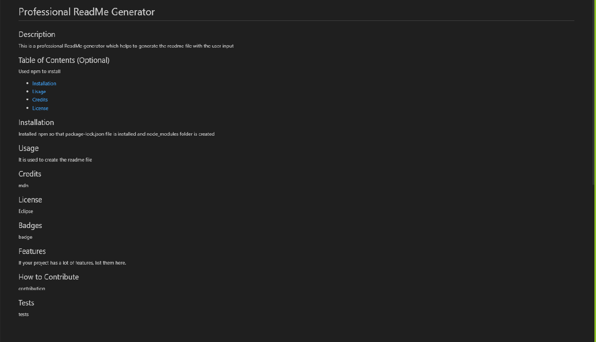

# 09 Node.js Challenge: Professional README Generator

# <Your-Project-Title>

## Description

Professional README Generator is used to create a readme file with the help of prompting questions to the user and getting the user input and then automatically generating a readme file for the user. This is a user-friendly web application and also saves time. Within few minutes user get the customized and autocomplete readme file.

## Technologies Used

- Javascrispt
- Node.js
- npm

## Installation

What are the steps required to install your project? Provide a step-by-step description of how to get the development environment running.
Installed npm using npm install in the terminal to get the package-lock.json file installed and node_modules folder.
Installed axios using npm install axios inquirer

## Usage

Screenshot of a README.md file

   

## Links

-URL link for the deployed Github application: https://rudrijoshi.github.io/ProfessionalReadme_Generator/

-URL link for the Github repository: https://github.com/rudrijoshi/ProfessionalReadme_Generator/

-URL link for the screencastify: https://watch.screencastify.com/v/dungS8wEJ6NzaokcKexk